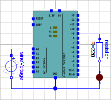
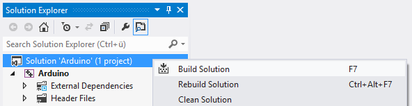

# Simulate Arduino Sketches in Modelica

Simulate your circuits and sketches on a virtual [Arduino Uno](https://www.arduino.cc/en/Main/ArduinoBoardUno)




## Prerequistites

- Dymola 2017 FD01 (Windows)
- Visual Studio 2012

## Getting Started

To simulate a sketch named `Blink` you have to perform the following steps.

- Save your sketch as `Sketches/Blink.ino`

- Open `VisualStudio/Arduino.sln` in Visual Studio

- In the top toolbar set the solution configuration to `Release` and the platform to `Win32`


- Open `Arduino > Source Files > Sketch.cpp` and change the #include statement
to include your sketch

```C
// include your sketch here
#include "Blink.ino"
```

- Right-click on the solution in the Solution Explorer and select `Build Solution` to build the Arduino library. `NOTE: `You have to repeat this step every time you make changes to your sketch.



- Load the Modelica library `Arduino/package.mo` in Dymola

- Add an instance of `Arduino/Components/ArduinoUno` to your model

- Simulate your model

## Limitations

Currently you can use only one instance of ArduinoUno in your Modelica model.

## Alternatives

For simulating simple Arduino circuits online you might want to have a look at
Autodesk's [Electronics Lab](https://circuits.io/lab).

## Using Libraries

To use a library in your sketch copy its header files (`*.h`) and source files (`*.cpp`) to the `Libraries` folder. If the library contains `.cpp` files you have to add them to the `Arduino` project by dragging them from the `Libraries` folder in the file browser onto the `Source Files` folder in the solution explorer.

## Arduino API

Functions that cannot be used in sketches are ~~striked through~~

#### Digital I/O

- [pinMode()](https://www.arduino.cc/en/Reference/PinMode)
- [digitalWrite()](https://www.arduino.cc/en/Reference/DigitalWrite)
- [digitalRead()](https://www.arduino.cc/en/Reference/DigitalRead)

#### Analog I/O

- [analogReference()](https://www.arduino.cc/en/Reference/AnalogReference)
- [analogRead()](https://www.arduino.cc/en/Reference/AnalogRead)
- [analogWrite() - PWM](https://www.arduino.cc/en/Reference/AnalogWrite)

#### Due & Zero only

- ~~analogReadResolution()~~
- ~~analogWriteResolution()~~

#### Advanced I/O

- ~~tone()~~
- ~~noTone()~~
- ~~shiftOut()~~
- ~~shiftIn()~~
- [pulseIn()](https://www.arduino.cc/en/Reference/PulseIn)

#### Time

- [millis()](https://www.arduino.cc/en/Reference/Millis)
- [micros()](https://www.arduino.cc/en/Reference/Micros)
- [delay()](https://www.arduino.cc/en/Reference/Delay)
- [delayMicroseconds()](https://www.arduino.cc/en/Reference/DelayMicroseconds)

#### Math

- [min()](https://www.arduino.cc/en/Reference/Min)
- [max()](https://www.arduino.cc/en/Reference/Max)
- [abs()](https://www.arduino.cc/en/Reference/Abs)
- [constrain()](https://www.arduino.cc/en/Reference/Constrain)
- [map()](https://www.arduino.cc/en/Reference/Map)
- [pow()](https://www.arduino.cc/en/Reference/Pow)
- [sqrt()](https://www.arduino.cc/en/Reference/Sqrt)

#### Trigonometry

- [sin()](https://www.arduino.cc/en/Reference/Sin)
- [cos()](https://www.arduino.cc/en/Reference/Cos)
- [tan()](https://www.arduino.cc/en/Reference/Tan)

#### Characters

- [isAlphaNumeric()](https://www.arduino.cc/en/Reference/IsAlphaNumeric)
- [isAlpha()](https://www.arduino.cc/en/Reference/IsAlpha)
- [isAscii()](https://www.arduino.cc/en/Reference/IsAscii)
- ~~[isWhitespace()](https://www.arduino.cc/en/Reference/IsWhitespace)~~
- [isControl()](https://www.arduino.cc/en/Reference/IsControl)
- [isDigit()](https://www.arduino.cc/en/Reference/IsDigit)
- [isGraph()](https://www.arduino.cc/en/Reference/IsGraph)
- [isLowerCase()](https://www.arduino.cc/en/Reference/IsLowerCase)
- [isPrintable()](https://www.arduino.cc/en/Reference/IsPrintable)
- [isPunct()](https://www.arduino.cc/en/Reference/IsPunct)
- [isSpace()](https://www.arduino.cc/en/Reference/IsSpace)
- [isUpperCase()](https://www.arduino.cc/en/Reference/IsUpperCase)
- [isHexadecimalDigit()](https://www.arduino.cc/en/Reference/IsHexadecimalDigit)

#### Random Numbers

- [randomSeed()](https://www.arduino.cc/en/Reference/RandomSeed)
- [random()](https://www.arduino.cc/en/Reference/Random)

#### Bits and Bytes

- [lowByte()](https://www.arduino.cc/en/Reference/LowByte)
- [highByte()](https://www.arduino.cc/en/Reference/HighByte)
- [bitRead()](https://www.arduino.cc/en/Reference/BitRead)
- [bitWrite()](https://www.arduino.cc/en/Reference/BitWrite)
- [bitSet()](https://www.arduino.cc/en/Reference/BitSet)
- [bitClear()](https://www.arduino.cc/en/Reference/BitClear)
- [bit()](https://www.arduino.cc/en/Reference/Bit)

#### External Interrupts

- [attachInterrupt()](https://www.arduino.cc/en/Reference/AttachInterrupt)
- [detachInterrupt()](https://www.arduino.cc/en/Reference/DetachInterrupt)

#### Interrupts

- [interrupts()](https://www.arduino.cc/en/Reference/Interrupts)
- [noInterrupts()](https://www.arduino.cc/en/Reference/NoInterrupts)

#### Communication

- [Serial](https://www.arduino.cc/en/Reference/Serial) `only: print(), println(), write()`
- ~~Stream~~

#### USB (32u4 based boards and Due/Zero only)

- ~~Keyboard~~
- ~~Mouse~~
